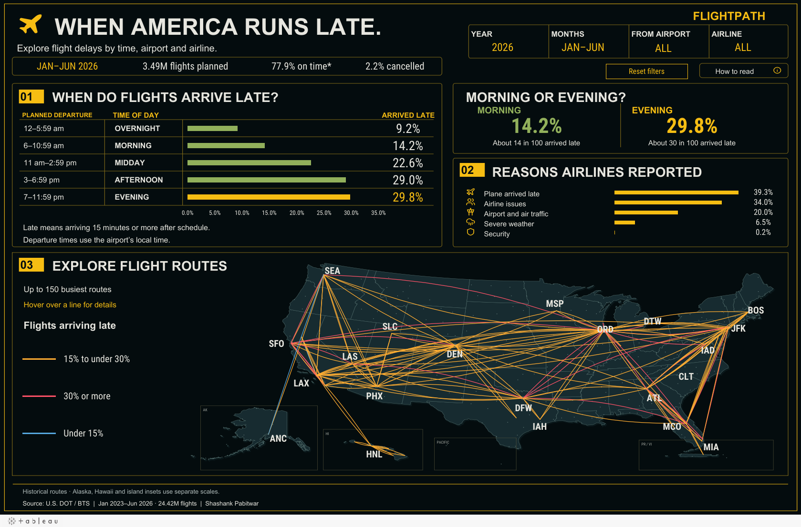

# When America Runs Late

**An Excel and Tableau project exploring 24.42 million U.S. flights.**

Does the time you leave change how often your flight arrives late? I started with this question, then looked at how the pattern changes across airports, airlines and routes. This project follows the work from flight records to a dashboard anyone can explore.

**[Open the live Tableau dashboard](https://public.tableau.com/app/profile/shashank.pabitwar/viz/WHENAMERICARUNSLATE/WhenAmericaRunsLate)** · **[Download the editable Tableau workbook](https://github.com/Shashankpabitwar123/us-airline-operations-delay-analytics/raw/refs/heads/main/tableau/When_America_Runs_Late.twbx)** · **[Download the Excel workbook](https://github.com/Shashankpabitwar123/us-airline-operations-delay-analytics/raw/refs/heads/main/excel/Flightpath.xlsx)**

*This is an image of the published dashboard. Open the live version to use the filters and hover over routes.*

## How the project came together

### 1. Start with the flight records

I used U.S. Department of Transportation / Bureau of Transportation Statistics reporting-carrier data: **24,416,952 scheduled domestic flights from January 2023 through June 2026**. Python prepared the monthly files, and SQL organized them into tables for analysis. The source links and retrieval details are in the [source manifest](data/source_manifest.json).

### 2. Make the numbers consistent

Before building the charts, I checked missing values, duplicate flight keys and monthly totals. I also corrected the original version's arrival-rate calculation: cancelled and diverted flights should not count as eligible arrivals. Cancellation rates still use all scheduled flights.

Every percentage is calculated from its underlying counts, so filtering an airport or airline keeps the totals consistent. The current model passes **26 validation checks**. [See the checks](docs/evidence/validation.json) or read the [plain-language definitions](docs/data_dictionary.md).

### 3. Explore the patterns in Excel

I built an [Excel workbook](excel/Flightpath.xlsx) with views for the network, airports, airlines, departure times and data quality. Its supporting sheets contain the summary tables behind the analysis. I also added a [Power Query import](power_query/flightpath_monthly.pq) for the monthly export and an [executed Python/SQL notebook](notebooks/flightpath_analysis.ipynb) for deeper comparisons.

### 4. Turn the analysis into one Tableau dashboard

The final dashboard brings the story onto one page:

- **When do flights arrive late?** Compare late-arrival rates by planned departure time.
- **Morning or evening?** See the two groups side by side.
- **Reasons airlines reported.** Compare the reported categories of delay minutes.
- **Explore flight routes.** Hover over up to 150 busy routes and compare their delay rates.

Year, month, departure-airport and airline filters update the views. A reset button and a short reading guide help visitors explore. The packaged workbook includes the data and editable worksheets; [see how to open and edit it](tableau/README.md).

## What I found

With **January–June 2026** selected in the dashboard:

| Finding | Result |
|---|---:|
| Planned flights | 3.49 million |
| Eligible arrivals that were on time | 77.9% |
| Planned flights cancelled | 2.2% |
| Morning flights arriving late | 14.2% |
| Evening flights arriving late | 29.8% |

Evening flights had a higher observed delay rate. This describes a pattern; it does not prove that changing departure time causes the difference. The notebook also compares morning and evening within the same route, airline and month. [Read the methods and limitations](docs/methodology_and_limitations.md).

## What I used

| Tool | Its role |
|---|---|
| Python, pandas and Parquet | Prepare monthly records and preserve a reusable local dataset |
| SQL / DuckDB | Build summary tables, calculate weighted rates and check totals |
| Excel and Power Query | Explore the results and import monthly summaries |
| Tableau Desktop / Tableau Public | Build, edit and share the interactive dashboard |

The dashboard uses summarized flight counts and a packaged Hyper extract, so it can represent 24.42 million flights without drawing millions of marks. Publishing also required a valid Tableau workbook structure and correctly registered actions. [Read the build story](docs/project_story.md).

## Explore the work

- [Excel preview](docs/evidence/excel/Network.png)
- [SQL analysis](sql/analysis_queries.sql) and [executed notebook](notebooks/flightpath_analysis.ipynb)
- [Data quality report](docs/data_quality_report.md)
- [Reproduction guide](docs/reproduction.md) and [release verification](docs/release_status.md)
- [Original Excel-only release](archive/2025-release/README.md) — retained for history; use the current release for corrected findings

**Source:** [BTS reporting-carrier data](https://www.transtats.bts.gov/Fields.asp?gnoyr_VQ=FGJ). This is historical domestic reporting-carrier data, not live flight tracking. **Built by Shashank Pabitwar.**
